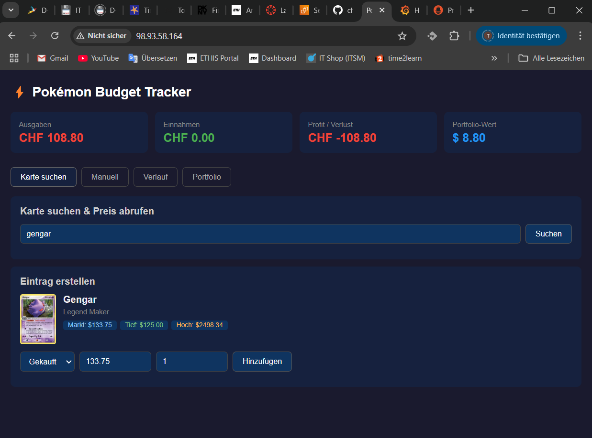
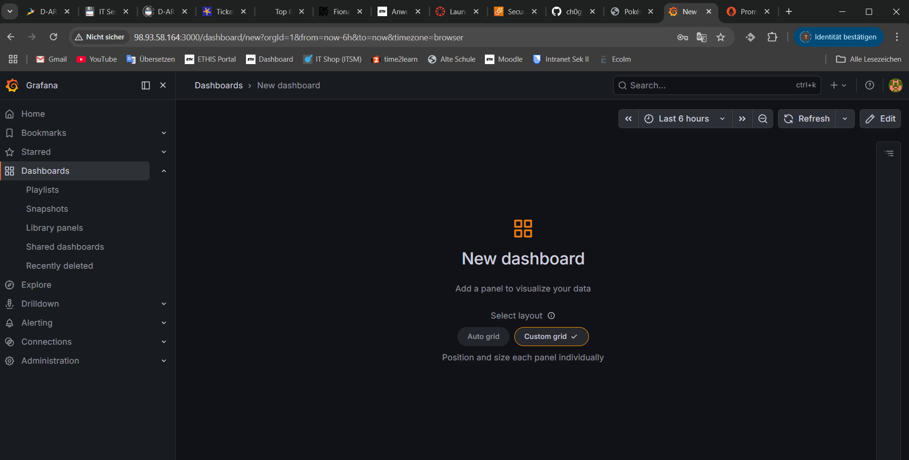
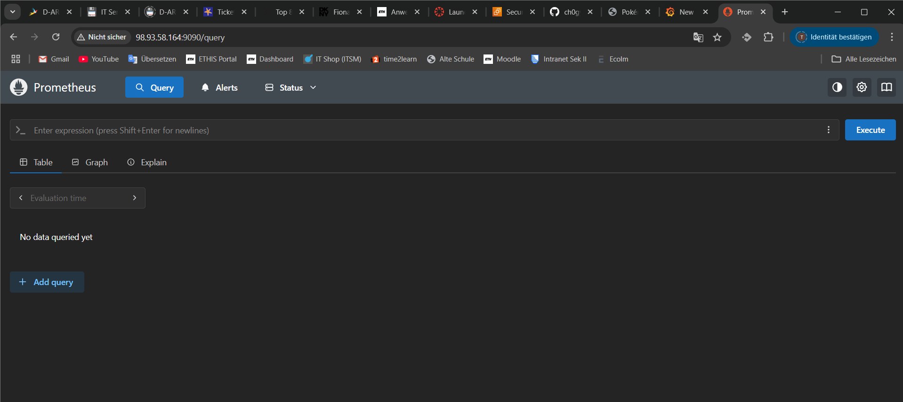
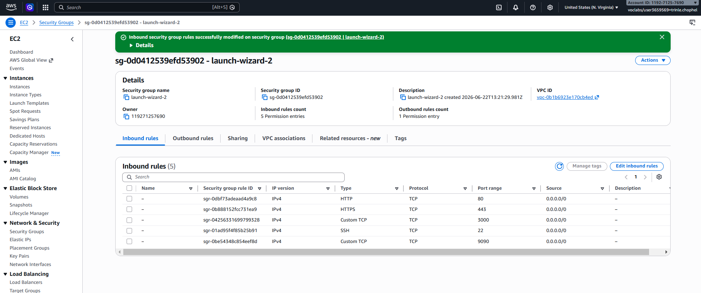

# Systemdokumentation – Pokémon Budget Tracker

**Modul:** M300 – Cloud-Lösungen realisieren
**Datum:** 12. Juni 2026

---

## Inhaltsverzeichnis
- [1. Architektur & Komponenten](#1-architektur--komponenten)
- [2. Installation & Setup](#2-installation--setup)
- [3. Konfiguration](#3-konfiguration)
- [4. Netzwerk & Sicherheit](#4-netzwerk--sicherheit)
- [5. Monitoring & Logging](#5-monitoring--logging)

---

## 1. Architektur & Komponenten

```
Browser → Nginx (Port 80) → Flask Backend (Port 5000) → MySQL (Port 3306)
                                    ↓
                            Prometheus (Port 9090)
                                    ↓
                            Grafana (Port 3000)
```

| Container | Image | Zweck |
|-----------|-------|-------|
| pokemon-frontend | nginx:alpine | Statisches Frontend ausliefern, Reverse Proxy |
| pokemon-backend | python:3.11-slim | REST API (Flask) |
| pokemon-db | mysql:8.0 | Datenbank |
| pokemon-prometheus | prom/prometheus | Metriken sammeln |
| pokemon-grafana | grafana/grafana | Dashboard & Alerts |

---

## 2. Installation & Setup

### SSH Verbindung
```bash
ssh -i poggermon.pem ubuntu@EC2-IP
```

> Die `.pem` Datei muss im gleichen Ordner sein wo du den Befehl ausführst.

### Voraussetzungen
- AWS EC2 (Ubuntu 22.04, t2.micro, 20GB Storage)
- Docker & Docker Compose
- GitHub Repository

### Server aufsetzen
```bash
sudo apt update
sudo apt install -y docker.io docker-compose git
sudo usermod -aG docker ubuntu
exit  # neu einloggen damit Gruppe aktiv wird
```

### App deployen
```bash
git clone https://github.com/DEINNAME/m300
cd m300/Code
docker-compose up --build -d
```

### Überprüfen ob alles läuft
```bash
docker ps
```


Alle 5 Container laufen erfolgreich:
- `pokemon-frontend` – Port 80
- `pokemon-backend` – Port 5000
- `pokemon-db` – Port 3306 (healthy)
- `pokemon-grafana` – Port 3000
- `pokemon-prometheus` – Port 9090

### Erreichbare Services

**App** – `http://98.93.58.164`



**Grafana** – `http://98.93.58.164:3000`



**Prometheus** – `http://98.93.58.164:9090`



---

## 3. Konfiguration

### Umgebungsvariablen (docker-compose.yml)
| Variable | Wert | Zweck |
|----------|------|-------|
| MYSQL_HOST | db | Hostname der Datenbank |
| MYSQL_USER | pokemon | Datenbankbenutzer |
| MYSQL_PASSWORD | pokemon123 | Datenbankpasswort |
| MYSQL_DATABASE | pokemon_tracker | Datenbankname |
| GF_SECURITY_ADMIN_PASSWORD | admin123 | Grafana Login |

### Datenbank
Die Tabellen werden automatisch beim ersten Start über `init.sql` erstellt. Das File wird via Docker Volume eingebunden:
```yaml
- ./init.sql:/docker-entrypoint-initdb.d/init.sql
```

---

## 4. Netzwerk & Sicherheit

### AWS Security Group
| Port | Protokoll | Zweck |
|------|-----------|-------|
| 22 | TCP | SSH Zugriff |
| 80 | TCP | HTTP (Frontend) |
| 443 | TCP | HTTPS |
| 3000 | TCP | Grafana Dashboard |
| 9090 | TCP | Prometheus |

### Netzwerk intern
Alle Container laufen im gleichen Docker-Netzwerk (`code_default`) und kommunizieren über den Container-Namen:
- Frontend → Backend: `http://backend:5000`
- Backend → Datenbank: `db:3306`
- Prometheus → Backend: `http://backend:5000/metrics`



### Sicherheitsmassnahmen
- SSH nur mit Key-Pair (kein Passwort-Login)
- Datenbankpasswörter als Umgebungsvariablen (nicht im Code)
- MySQL nicht öffentlich erreichbar (nur intern im Docker-Netzwerk)

---

## 5. Monitoring & Logging

### Prometheus
Sammelt alle 15 Sekunden Metriken vom Backend-Endpunkt `/metrics`.

Konfiguration in `prometheus.yml`:
```yaml
scrape_configs:
  - job_name: 'pokemon-backend'
    static_configs:
      - targets: ['backend:5000']
```

### Grafana
- Erreichbar unter: `http://EC2-IP:3000`
- Login: `admin / admin123`
- Datenquelle: Prometheus (`http://prometheus:9090`)

### Logs anzeigen
```bash
# Alle Container
docker-compose logs

# Einzelner Container
docker logs pokemon-backend
docker logs pokemon-db
```

---

*Letzte Aktualisierung: 12. Juni 2026*