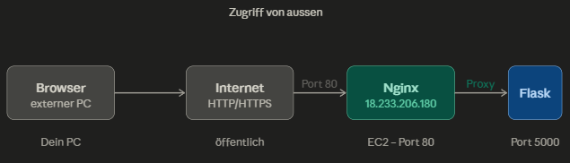
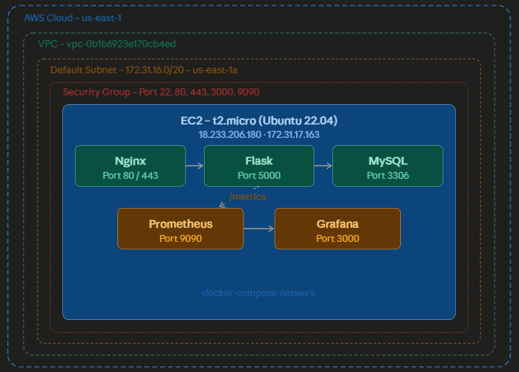
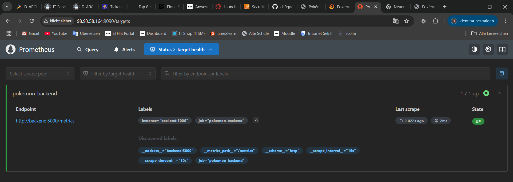
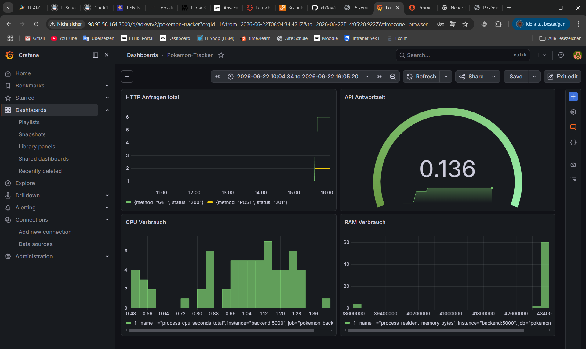
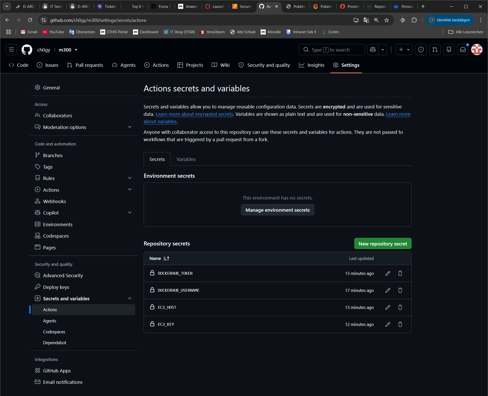
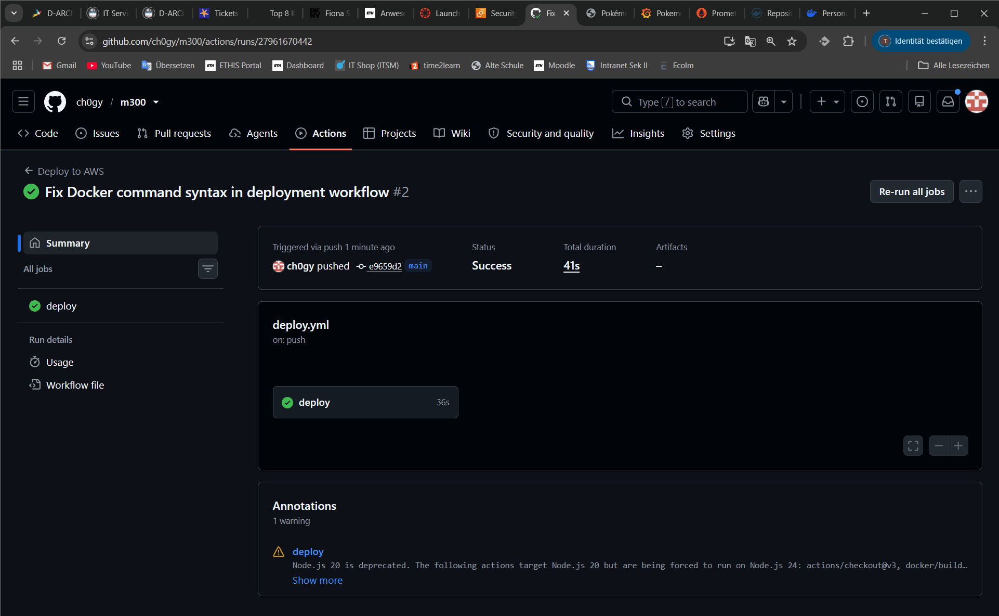
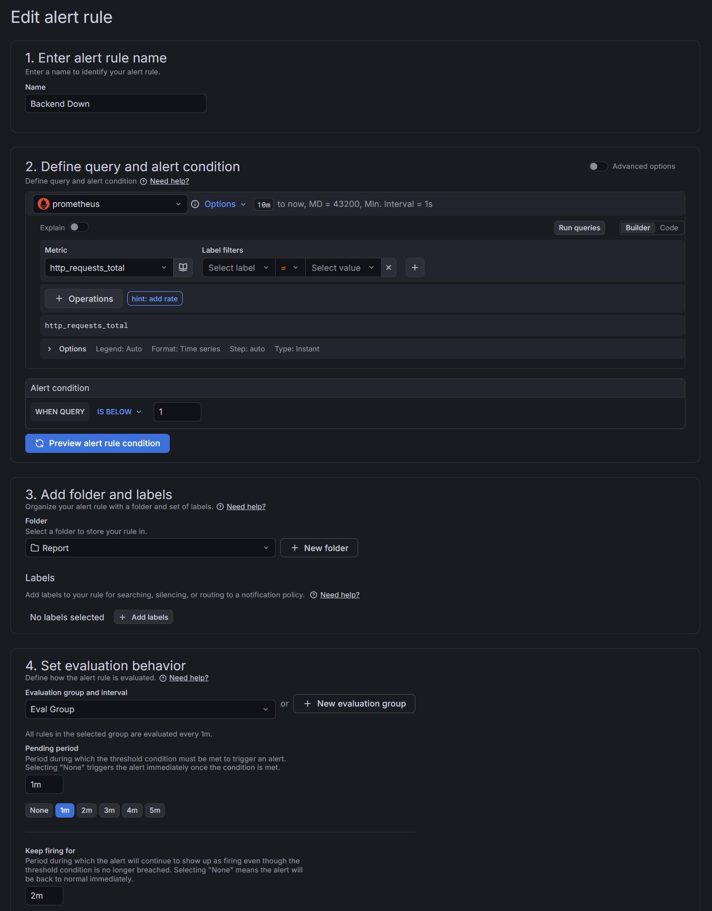

# Systemdokumentation – Pokémon Budget Tracker

**Modul:** M300 – Cloud-Lösungen realisieren
**Datum:** 12. Juni 2026

---

## Inhaltsverzeichnis
- [1. Übersicht](#1-übersicht)
- [2. Netzwerkdiagramme](#2-netzwerkdiagramme)
- [3. Architektur & Komponenten](#3-architektur--komponenten)
- [4. Installation & Setup](#4-installation--setup)
- [5. Konfiguration](#5-konfiguration)
- [6. Netzwerk & Sicherheit](#6-netzwerk--sicherheit)
- [7. Monitoring & Logging](#7-monitoring--logging)
- [8. CI/CD Pipeline](#8-cicd-pipeline)
- [9. Alerting](#9-alerting)

---

## 1. Übersicht

Hier die wichtigsten Infos zum Projekt auf einen Blick:

| Eigenschaft | Wert |
|-------------|------|
| Projekt | Pokémon Budget Tracker |
| Cloud | AWS – us-east-1 |
| Server | EC2 t2.micro – 18.233.206.180 |
| Datenbank | MySQL 8.0 (Docker Container) |
| CI/CD | GitHub Actions |
| Monitoring | Prometheus + Grafana |

---

## 2. Netzwerkdiagramme

So sieht die ganze Umgebung aus, einmal wie man von aussen drauf zugreift und einmal wie alles in AWS aufgebaut ist.

### Zugriff von aussen



### AWS Infrastruktur



---

## 3. Architektur & Komponenten

Die App läuft komplett in Docker Containern. Der Browser schickt eine Anfrage an Nginx, der leitet sie weiter an Flask, und Flask holt sich die Daten aus MySQL. Prometheus sammelt nebenbei alle Metriken und Grafana zeigt sie als Dashboard an.

```
Browser → Nginx (Port 80) → Flask Backend (Port 5000) → MySQL (Port 3306)
                                    ↓
                            Prometheus (Port 9090)
                                    ↓
                            Grafana (Port 3000)
```

| Container | Image | Zweck |
|-----------|-------|-------|
| pokemon-frontend | nginx:alpine | Frontend ausliefern und Anfragen weiterleiten |
| pokemon-backend | python:3.11-slim | REST API (Flask) |
| pokemon-db | mysql:8.0 | Datenbank |
| pokemon-prometheus | prom/prometheus | Metriken sammeln |
| pokemon-grafana | grafana/grafana | Dashboard & Alerts |

---

## 4. Installation & Setup

### SSH Verbindung
Zuerst mit dem Server verbinden. Die `.pem` Datei muss im gleichen Ordner sein:
```bash
ssh -i poggermon.pem ubuntu@EC2-IP
```

### Voraussetzungen
- AWS EC2 (Ubuntu 22.04, t2.micro, 20GB Storage)
- Docker & Docker Compose
- GitHub Repository

### Server aufsetzen
Docker und Git installieren, dann den User zur Docker-Gruppe hinzufügen damit man nicht immer `sudo` braucht:
```bash
sudo apt update
sudo apt install -y docker.io docker-compose git
sudo usermod -aG docker ubuntu
exit  # neu einloggen damit die Gruppe aktiv wird
```

### App deployen
Repo clonen und starten:
```bash
git clone https://github.com/DEINNAME/m300
cd m300/Code
docker-compose up --build -d
```

### Überprüfen ob alles läuft
```bash
docker ps
```


Alle 5 Container müssen laufen:
- `pokemon-frontend` (Port 80)
- `pokemon-backend` (Port 5000)
- `pokemon-db` (Port 3306, healthy)
- `pokemon-grafana` (Port 3000)
- `pokemon-prometheus` (Port 9090)

### Erreichbare Services

**App:** `http://18.233.206.180`


**Grafana:** `http://18.233.206.180:3000`


**Prometheus:** `http://18.233.206.180:9090`


---

## 5. Konfiguration

### Umgebungsvariablen (docker-compose.yml)
Alle Zugangsdaten werden als Umgebungsvariablen gesetzt. Nie direkt im Code hardcoden!

| Variable | Wert | Zweck |
|----------|------|-------|
| MYSQL_HOST | db | Hostname der Datenbank |
| MYSQL_USER | pokemon | Datenbankbenutzer |
| MYSQL_PASSWORD | pokemon123 | Datenbankpasswort |
| MYSQL_DATABASE | pokemon_tracker | Datenbankname |
| GF_SECURITY_ADMIN_PASSWORD | admin123 | Grafana Login |

### Datenbank
Die Tabellen werden beim ersten Start automatisch über `init.sql` erstellt. Das File wird via Docker Volume eingebunden:
```yaml
- ./init.sql:/docker-entrypoint-initdb.d/init.sql
```

---

## 6. Netzwerk & Sicherheit

### AWS Security Group
Nur die nötigen Ports sind offen:

| Port | Protokoll | Zweck |
|------|-----------|-------|
| 22 | TCP | SSH Zugriff |
| 80 | TCP | HTTP (Frontend) |
| 443 | TCP | HTTPS |
| 3000 | TCP | Grafana Dashboard |
| 9090 | TCP | Prometheus |


### Netzwerk intern
Alle Container laufen im gleichen Docker-Netzwerk (`code_default`) und reden über den Container-Namen miteinander:
- Frontend → Backend: `http://backend:5000`
- Backend → Datenbank: `db:3306`
- Prometheus → Backend: `http://backend:5000/metrics`

### Sicherheitsmassnahmen
- SSH nur mit Key-Pair, kein Passwort-Login möglich
- Datenbankpasswörter als Umgebungsvariablen, nie im Code
- MySQL ist nicht von aussen erreichbar, nur intern im Docker-Netzwerk

---

## 7. Monitoring & Logging

### Prometheus
Prometheus holt sich alle 15 Sekunden die Metriken vom Backend über den `/metrics` Endpunkt.

Wenn der Status **UP** ist, läuft alles sauber:



- **Status: UP**, Prometheus erreicht das Backend
- **Scrape Interval: 15s**, alle 15 Sekunden werden Daten geholt
- **Endpoint:** `http://backend:5000/metrics`

Konfiguration in `prometheus.yml`:
```yaml
scrape_configs:
  - job_name: 'pokemon-backend'
    static_configs:
      - targets: ['backend:5000']
```

### Grafana
- Erreichbar unter: `http://EC2-IP:3000`
- Login: `admin / admin123`
- Datenquelle: Prometheus (`http://prometheus:9090`)

Das Dashboard **Pokemon-Tracker** zeigt live folgende Panels:

| Panel | Metric | Was man sieht |
|-------|--------|---------------|
| HTTP Anfragen total | `http_requests_total` | Wie viele GET/POST Anfragen reinkommen |
| API Antwortzeit | `http_request_duration_seconds_sum` | Wie schnell das Backend antwortet |
| CPU Verbrauch | `process_cpu_seconds_total` | CPU-Auslastung des Backends |
| RAM Verbrauch | `process_resident_memory_bytes` | Speicherverbrauch des Backends |



### Logs anschauen
Falls etwas nicht stimmt, einfach die Logs checken:
```bash
# Alle Container
docker-compose logs

# Einzelner Container
docker logs pokemon-backend
docker logs pokemon-db
```

---

## 8. CI/CD Pipeline

Jedes Mal wenn Code auf den `main` Branch gepusht wird, läuft die Pipeline automatisch durch:

1. Code wird ausgecheckt
2. Docker Image wird gebaut und auf Docker Hub gepusht
3. EC2 holt sich das neue Image und startet die Container neu

Kein manuelles Deployen mehr nötig!

### GitHub Secrets

Alle sensiblen Daten sind als Repository Secrets gespeichert:



| Secret | Zweck |
|--------|-------|
| `DOCKERHUB_USERNAME` | Docker Hub Benutzername |
| `DOCKERHUB_TOKEN` | Docker Hub Access Token |
| `EC2_HOST` | IP-Adresse des EC2 Servers |
| `EC2_KEY` | SSH Private Key für EC2 Zugriff |

### Erfolgreicher Pipeline-Lauf



Status **Success** in 41 Sekunden. Läuft!

---

## 9. Alerting

In Grafana wurde ein Alert eingerichtet, der automatisch meldet wenn das Backend nicht mehr erreichbar ist.

### Alert Rule: Backend Down

| Einstellung | Wert |
|-------------|------|
| Name | Backend Down |
| Metric | `http_requests_total` |
| Bedingung | IS BELOW 1 |
| Evaluate every | 1m |
| Pending period | 1m |
| Keep firing for | 2m |



---

*Letzte Aktualisierung: 23. Juni 2026*